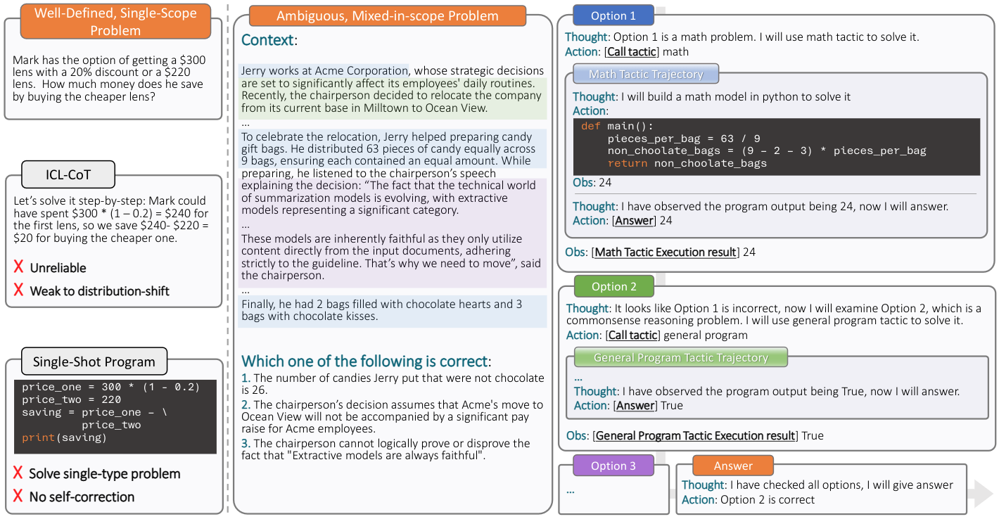

# Reasoning in the Wild

This repo contains the implementation of the work 
**Can LLMs Reason in the Wild with Programs?**

[Yuan Yang](https://gblackout.github.io/), [Siheng Xiong](https://dblp.org/pid/277/4221.html), [Ali Payani](https://scholar.google.com/citations?user=9rHwD8wAAAAJ&hl=en), [Ehsan Shareghi](https://eehsan.github.io/) and [Faramarz Fekri](https://fekri.ece.gatech.edu/)

[[Paper](https://arxiv.org/abs/2406.13764)] [[Data](https://huggingface.co/datasets/yuan-yang/ReWild)] [[Model](https://huggingface.co/yuan-yang)]

In this work, we introduce the *reasoning in the wild* task, where an LLM is tasked
to solve a reasoning problem of unknown type
by identifying the sub-problems and their corresponding formalisms,  and writing a program
to solve each sub-problem, guided by a *tactic*.

We create a large tactic-guided trajectory dataset (ReWild) containing detailed solutions to a diverse set of reasoning 
problems, ranging from well-defined single-form reasoning (e.g., math, logic), to ambiguous and hybrid ones (e.g., 
commonsense, combined math and logic). This allows us to test various aspects of LLMs reasoning at the fine-grained 
level such as the selection and execution of tactics, and the tendency to take undesired shortcuts.



**Reasoning in the wild (ReWild)** dataset:
This dataset consists of 6.7K Trajectories of GPT-4 models solving reasoning problems from GSM8K, FOLIO, proScript, and 
ReClor dataset by writing programs and interacting with an interpreter environment.

This dataset supports training and evaluation of LLMs on two modes:
- `standalone`: the LLM is given a problem with its ground-truth `tactic` and is tasked to solve the problem directly.
- `hybrid`: the LLM is given a hybrid problem that is blended from several subproblems, with each of their answer being
an option. For every option, the LLM is tasked to first find the right `tactic` and then solve the subproblem by
extracting the relevant information from the blended context. Finally, the model answer the hybrid problem by 
aggregating the results from all the subproblems.   


**Tactic-guided reasoner (Tiger)** model:
We fine-tune a LLaMA-8B model on the training set of ReWild. The resulting model, Tiger-8B shows strong performance 
in this task compared to power LLMs such as GPT-4 turbo.
The model comes with several LoRA adapters:
- `Tiger-Routing-8B` ([HF](https://huggingface.co/yuan-yang/Tiger-Routing-8B)): the routing model for identifying the subproblem and its `tactic` in the `hybrid` setup.
- `Tiger-PJ-8B` ([HF](https://huggingface.co/yuan-yang/Tiger-PJ-8B)): the problem-solving model that is trained with perfect trajectories.
- `Tiger-IPJ-8B` ([HF](https://huggingface.co/yuan-yang/Tiger-IPJ-8B)): the problem-solving model that is trained with perfect and imperfect trajectories (see details in the 
paper), which we find it works better than `Tiger-PJ-8B` in experiments. 


## Install

1. Clone this repo
```commandline
git clone git@github.com:gblackout/Reason-in-the-Wild.git
cd Reason-in-the-Wild
```

2. Prepare environment
```
conda create -n reason-in-wild python=3.9
conda activate reason-in-wild
pip install -r requirements.txt
```

3. Set up your api keys

Create a text file with your api keys to the LLMs listed in 
each line. For example, create a file `./llm-api-keys.txt`:
```commandline
openai: <key>
gemini: <key>
mistral: <key>
anthropic: <key>
cohere: <key>
```
The order does not matter and you can skip those you don't have.

## Dataset

Download the standalone and hybrid dataset from our HF [repo](https://huggingface.co/datasets/yuan-yang/ReWild), 
and put it in `data` folder:
- `standalone_train.json`, `standalone_test.json`: the train and test data for standalone reasoning problems from 
GSM8K, FOLIO, proScript, and ReClor datasets  
- `hybrid_train.json`, `hybrid_test.json`: the train and test data for hybrid reasoning problems.

## Notebook Demos

We prepare some notebook demos in `notebooks` for you get started with our repo:
- `inspect-traj.ipynb`: this showcases the trajectory data structure we are working on and how to inspect and modify it.
- `run-and-eval-traj.ipynb`: this showcases how to use some of the core functionalities of this repo such as 
`LLMRequestManager` and `TrajRunner` to infer trajectories on `ReWild` dataset and evaluate the results.
- `Tiger-data-prep.ipynb`: this showcases how to create perfect trajectory (PJ), imperfect trajectory (IPJ), and routing
trajectory (RPJ) data, which are used for fine-tuning. You don't need this if you just do inference with Tiger model. 

## Run and evaluate LLMs on ReWild
You can run and evaluate your LLMs using `traj_infer.py` and `metrics/eval_trajs.py`.
Check out the `run-and-eval-traj.ipynb` for a quick demo and use the scripts in `scripts` to run full generation.

For example, to run inference with GPT4 turbo on standalone dataset:
- Copy the `run_api_llm_infer.sh` to root `./`
- Change `<PATH TO DATASET>` to where you put the data, for example `"data/standalone_test.json"`
- Change `<NAME_OF_THE_API_MODEL>` to `'gpt-4-turbo-2024-04-09'` (supported model listed in `LLMRequestManager`)
- Fill in `<PATH_TO_SAVE_TRAJS>`, .e.g., `"logs/standalone_gpt4_eval.json"`
- Run `bash run_api_llm_infer.sh`

## Tiger-8B training and inference

### Inference

Inference with Tiger-8B shares the same interface as those API LLMs with additional steps of loading the model.
Use the script `scripts/run_tiger_infer.sh` to do full inference.

For example, to run inference with `Tiger-IPJ-8B` on standalone dataset:
- Copy the `run_tiger_infer.sh` to root `./`
- Change `<PATH TO DATASET>` to where you put the data, for example `"data/standalone_test.json"`
- Change `<PATH TO BASE MODEL>` to the path to the base LLaMA-8B model; you need to download it separately from
[here](https://huggingface.co/meta-llama/Meta-Llama-3-8B).
- Change `<PATH TO PEFT>` to the path to the peft adapter; you need to download it from my HF
[repo](https://huggingface.co/yuan-yang/Tiger-IPJ-8B).
- Change `<PATH TO SAVE>` to the saved file, for example `"logs/tiger_standalone_eval.json"`
- Run `bash run_tiger_infer.sh`

For Hybrid inference, you need to additionally specify the `<PATH TO ROUT PEFT>`, which is the path the router adapter
that can be downloaded from [here](https://huggingface.co/yuan-yang/Tiger-Routing-8B).


### Training

You can use `scripts/traj_sft.sh` to finetune the model yourself.

To do so:
- Use the `Tiger-data-prep.ipynb` to generate the trainable seq data.
- Copy the `traj_sft.sh` to root `./`
- Change `<PATH TO BASE MODEL>` to the path to the base LLaMA-8B model
- Change `<PATH TO DATASET>` to the path to either the PJ, IPJ, or RPJ data you get from the `Tiger-data-prep.ipynb`, 
where you train `Tiger-PJ-8B`, `Tiger-IPJ-8B`, `Tiger-Routing-8B` respectively.
- Change `<PATH TO SAVE>` to the path to saving the checkpoints.

**Hardware requirements**:
Many trajectory token lengths are between 3K~6K, training it with LoRA r=64 and batch size 1 requires 60G+ VRAM even with 
gradient checkpointing on. This is due to intermediate activations grows quickly with seq length. So you need at least 
an A100 80G to do the fine-tuning. For inference, a 24G 4090 with int8 quantization on base model can handle up to 8K
seq just fine.


## Trajectory Generation

Apart from the training, inference, and evaluation pipeline, we also release the pipeline we used to generate the
trajectory data. See `example_traj_datagen.py` for example.

As mentioned in the paper, we generated and verified ~1K trajectories for each of the four datasets:
GSM8K, FOLIO, proScript, and ReClor. We release this pipeline so that researchers interested in this paradigm could use 
it to continue the generation on these or some other datasets. 


## Acknowledgement

Some of the implementations are based on the following repos:
- [CodeBleu](https://github.com/microsoft/CodeXGLUE/blob/main/Code-Code/code-to-code-trans/CodeBLEU.MD): the CodeBleu module is modified from this repo.

This project is supported by OpenAI Researcher Access Program and Cohere For AI Research Grant.

## Citation
```commandline
@article{yang2024can,
  title={Can LLMs Reason in the Wild with Programs?},
  author={Yang, Yuan and Xiong, Siheng and Payani, Ali and Shareghi, Ehsan and Fekri, Faramarz},
  journal={arXiv preprint arXiv:2406.13764},
  year={2024}
}
```
